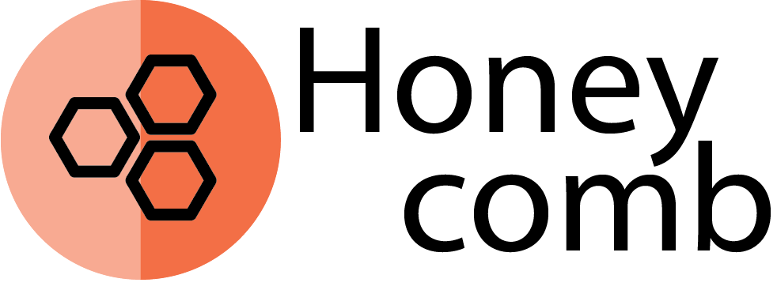

  

A framework for WordPress plugins

# Project Description

The point of this framework is to put common functionality for WordPress plugins in a single place.

The [hook](https://github.com/gios-asu/honeycomb/blob/develop/src/wordpress/hook.php) is the most important, and most used piece of functionality that this plugin provides. Every plugin or theme will normally want to hook onto WordPress functionality. The Hook class provides a simple and common interface for that.

[Traits](https://github.com/gios-asu/honeycomb/tree/develop/src/traits) are another area that still needs expanding upon. Traits are pieces of common functionality that WordPress Hooks commonly use.
